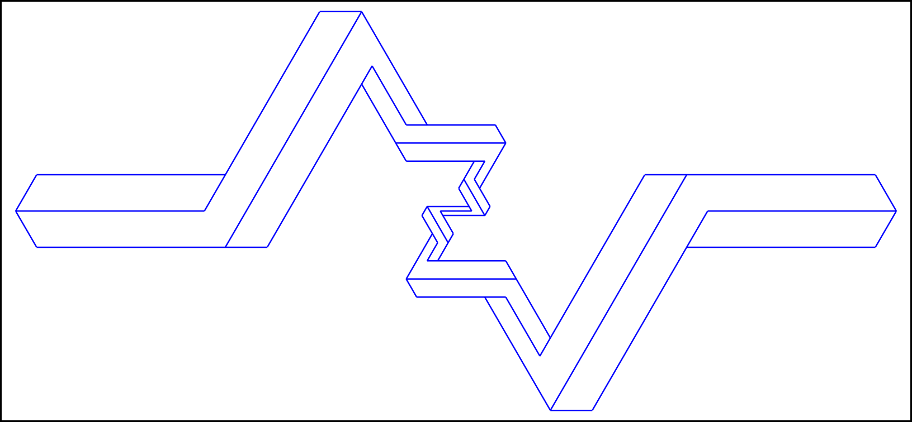

# impossible-rod
An impossible object in SVG:

One day, just about to wake up from a siesta, something just came into my mind for some reason: *is there an impossible object that is also self-similar?* This is very interesting, and after few days of some disorganized sketches and coding, I came up with the rod design as shown in the above image. I expected that this is infinitely self-similar. The output, while still cool, is not, unfortunately. I tried modifying the parameters, but still no luck.

I still believe that it is possible though, hence I ask the question in Math.SE which describes the situation more in terms of equations. Answering must involve either modifying `prop_dec()` and `qrop_dec()` in the html file, or a proof of impossibility.

Nevertheless, I hope to see more designs for self-similar impossible objects in general, whether the self-similarity is approximate like the output here, or is exact and thus infinite. Possible ideas include using angles different from the output here, knots/links, curves, different impossibility concept, etc.

Note: Internet connection required when opening html file; see second link below.

## Links
My Math.SE question: https://math.stackexchange.com/questions/4563416/is-a-self-similar-impossible-rod-possible

Powered by *d3.js*: https://d3js.org/
